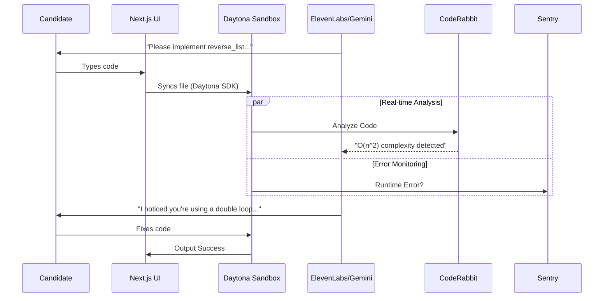

# 🎙️ DAYTONA Interview Sandbox

**"This AI interviewer watches you code, spots when you're taking a suboptimal approach, and asks exactly the question a senior engineer would ask—all through voice."**

## 💡 Concept

This project extends the **10xhr.ai winner's approach** by adding an **actual coding assessment**.
Candidates receive a voice-guided technical interview where they code in a **Daytona sandbox** while an **ElevenLabs agent** asks questions based on their real-time code changes. **Sentry** monitors for runtime errors, and **CodeRabbit** evaluates code quality.

## ⚙️ Technical Flow

1.  **🗣️ Challenge**: ElevenLabs conversational agent poses a coding challenge.
2.  **💻 Action**: Candidate codes in a Daytona sandbox with live preview.
3.  **👀 Observation**: Agent observes changes via Daytona file system API.
4.  **🧠 Analysis**: Uses CodeRabbit analysis to detect code smells and Gemini 3 Pro for logic verification.
5.  **💬 Interaction**: Agent asks follow-up questions based on the candidate's approach ("I see you used a nested loop, how does that scale?").
6.  **🛡️ Monitoring**: Sentry captures any exceptions or crashes during testing.
7.  **📊 Result**: Generates a competency report post-interview.

## 🏗️ Architecture



## 🏆 Prize Targets

*   **🥇 Grand Prize**: Solves an expensive, high-friction hiring problem.
*   **🗣️ Best Use of ElevenLabs**: Core conversational interface, not just a wrapper.
*   **☁️ Best Use of Daytona**: Manages the entire live coding environment.
*   **🐇 Best Use of CodeRabbit**: Deep integration for "Senior Engineer" level feedback.
*   **🛡️ Best Use of Sentry**: Real-time error monitoring during interviews.

## 🛠️ Technology Stack

| Component | Tech | Icon |
|-----------|------|------|
| **Frontend** | **Next.js 16** |  |
| | **React 19** |  |
| | **Tailwind CSS** |  |
| **Infrastructure** | **Daytona SDK** |  |
| | **Docker** |  |
| **AI & Voice** | **ElevenLabs** |  |
| | **Gemini 3 Pro** |  |
| **Analysis** | **CodeRabbit** |  |
| **Monitoring** | **Sentry** |  |

*Icons provided by [Icons8](https://icons8.com).*

## 🚀 Quick Start

1.  **Clone & Install**:
    ```bash
    git clone https://github.com/nihalnihalani/DAYTONA-InterviewSandBox.git
    cd DAYTONA-InterviewSandBox
    npm install
    ```

2.  **Env Setup**:
    Create `.env.local` with keys for Daytona, ElevenLabs, Gemini, and Sentry.

3.  **Run**:
    ```bash
    npm run dev
    ```

## 📂 Project Structure

```text
/
├── src/
│   ├── app/                # Next.js App Router
│   ├── components/         # UI Components
│   │   ├── agent/          # Voice Agent
│   │   └── editor/         # Monaco + Daytona
│   ├── lib/
│   │   ├── daytona.ts      # Sandbox Management
│   │   ├── coderabbit.ts   # Code Analysis
│   │   └── gemini.ts       # AI Reasoning
│   └── types/
```

## 🗓️ Roadmap

- [x] **Phase 1**: Core Daytona Sandbox Integration
- [x] **Phase 2**: ElevenLabs Voice Agent
- [x] **Phase 3**: CodeRabbit & Gemini Analysis
- [ ] **Phase 4**: Advanced Scenario Generation
- [ ] **Phase 5**: Multi-User Interview Mode
